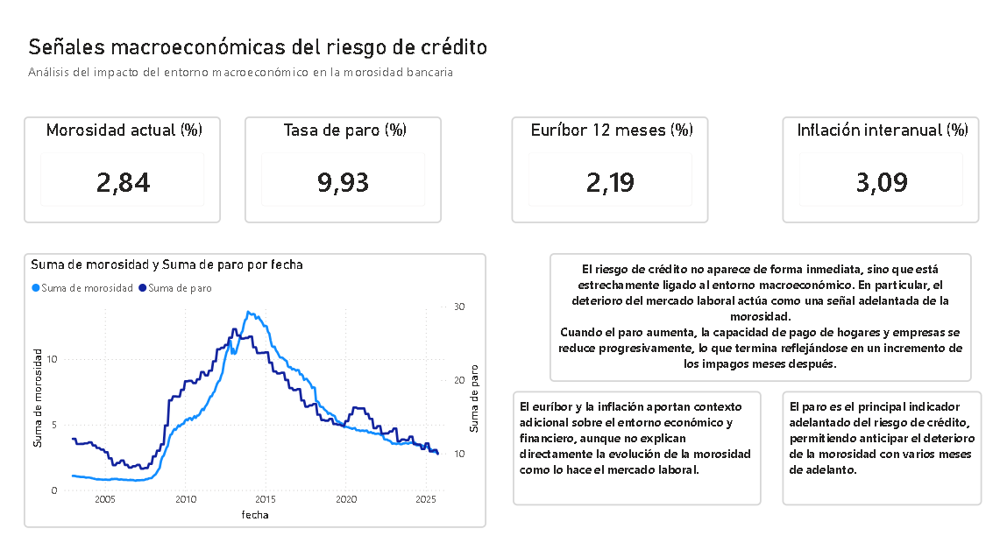
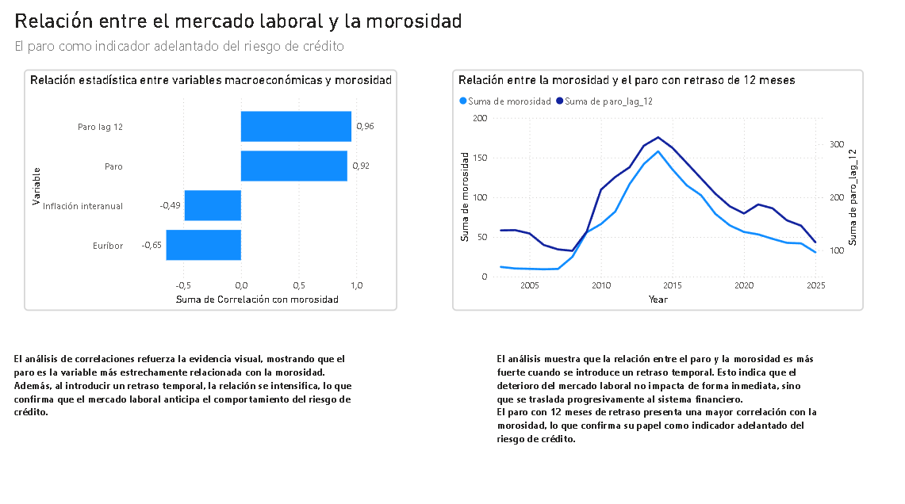
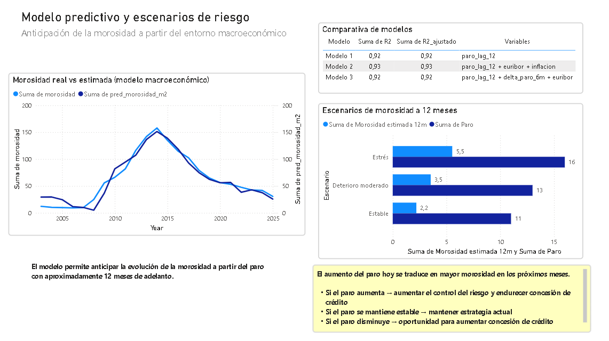

# Análisis macroeconómico del riesgo de crédito en España

## 1. Introducción

Este proyecto analiza el riesgo de crédito en España a partir de variables macroeconómicas públicas, con el objetivo de identificar señales tempranas de deterioro de la morosidad bancaria.

El enfoque no está orientado a predecir el impago de clientes individuales, sino a entender cómo el entorno económico puede anticipar el comportamiento del riesgo agregado en el sistema financiero y ayudar a la toma de decisiones en banca.

---

## 2. Objetivo

El objetivo del proyecto es construir una herramienta analítica que permita:

- anticipar aumentos de la morosidad a partir de variables macroeconómicas
- identificar qué factores explican mejor el deterioro del riesgo de crédito
- traducir ese análisis en señales útiles para negocio

En otras palabras, la pregunta que guía el proyecto es:

> **¿Cómo puede un banco anticipar un aumento del riesgo de crédito sin depender únicamente de datos internos?**

---

## 3. Enfoque de negocio

Este proyecto está planteado desde una lógica de negocio bancario.

No busca hacer un modelo complejo de predicción, sino responder a una necesidad real: **detectar con antelación cuándo el entorno económico empieza a deteriorarse y cómo eso puede trasladarse a la morosidad**.

Esto tiene aplicación directa en banca porque permite:

- ajustar criterios de concesión de crédito
- reforzar provisiones con antelación
- revisar la exposición al riesgo en cartera
- apoyar el seguimiento macroeconómico del riesgo

La idea central es simple:

> **la morosidad es un indicador tardío; el entorno macroeconómico permite detectar antes las señales de deterioro**

---

## 4. Datos utilizados

Se han utilizado exclusivamente fuentes públicas y oficiales:

- **Banco de España**
  - morosidad bancaria
  - Euríbor a 12 meses

- **INE**
  - tasa de paro
  - IPC

A partir de estas fuentes se construyó un dataset mensual con información desde aproximadamente **2002 hasta 2025**.

---

## 5. Procesamiento de datos

Se realizó un trabajo previo de limpieza y transformación para unificar las distintas fuentes y frecuencias temporales.

Principales transformaciones:

- conversión de formatos de fecha
- tratamiento de valores faltantes
- conversión del Euríbor diario a frecuencia mensual
- conversión del paro trimestral a frecuencia mensual
- cálculo de la inflación interanual
- creación de variables con retraso temporal (*lags*)

El resultado fue un dataset final con esta estructura:

- `fecha`
- `morosidad`
- `euribor`
- `inflacion_interanual`
- `paro`
- `paro_lag_12`

---

## 6. Hallazgo principal

El principal insight del proyecto es que **el paro actúa como indicador adelantado de la morosidad**.

El análisis muestra que:

- la relación entre paro y morosidad es muy alta
- esa relación es aún más fuerte cuando el paro se desplaza 12 meses
- el deterioro del mercado laboral precede al deterioro de la morosidad

Esto tiene una interpretación económica clara:

> cuando aumenta el paro, los ingresos de hogares y empresas se deterioran; ese efecto no impacta de forma inmediata, sino que termina reflejándose en la morosidad varios meses después

---

## 7. Modelización

Se construyeron varios modelos lineales sencillos para cuantificar esta relación.

### Modelo base
Se utilizó como variable principal el paro con 12 meses de retraso:

- `morosidad ~ paro_lag_12`

### Modelo extendido
Se añadió contexto macroeconómico con otras variables:

- `morosidad ~ paro_lag_12 + euribor + inflacion_interanual`

### Conclusión de la modelización
Los resultados confirmaron que:

- el **paro adelantado** concentra la mayor parte de la capacidad explicativa
- el **Euríbor** y la **inflación** aportan contexto adicional
- el objetivo del modelo no es acertar cada punto exacto, sino **anticipar la tendencia del riesgo**

---

## 8. Escenarios de riesgo a 12 meses

Una parte clave del proyecto es que el modelo permite traducir escenarios macroeconómicos en escenarios de morosidad.

Es importante aclarar que el proyecto:

- **no predice el paro**
- **sí permite estimar qué ocurriría con la morosidad si el paro evoluciona de una determinada manera**

Por ejemplo:

- si el paro aumenta, la morosidad esperada tenderá a aumentar en los próximos 12 meses
- si el paro se mantiene estable, el riesgo agregado tenderá a estabilizarse
- si el paro disminuye, el entorno sería más favorable para el crédito

Este enfoque es especialmente útil para banca porque convierte una señal macroeconómica en una herramienta de decisión.

---

## 9. Aplicación en banca

La utilidad del proyecto está en su aplicación práctica.

A partir de las señales detectadas, un banco puede:

- **endurecer criterios de concesión** cuando el mercado laboral empeora
- **anticipar provisiones** antes de que la morosidad observada aumente
- **revisar carteras más vulnerables** en contextos de deterioro macroeconómico
- **apoyar comités de riesgo** con indicadores adelantados sencillos e interpretables

La lógica de negocio es la siguiente:

> **si el paro sube hoy, el banco no necesita esperar a que la morosidad suba mañana para empezar a actuar**

---

## 10. Dashboard en Power BI

El proyecto se acompaña de un dashboard en Power BI estructurado en tres bloques:

### 1. Señales de riesgo

Muestra la evolución de la morosidad y del paro para identificar visualmente el deterioro del entorno macroeconómico.

### 2. Relación entre variables

Explica por qué el paro es el principal driver del riesgo de crédito y cómo mejora su relación con la morosidad cuando se introduce un retraso temporal.

### 3. Modelo y escenarios

Presenta la evolución real frente a la estimada y traduce distintos escenarios de paro en escenarios de morosidad a 12 meses, conectando directamente con decisiones de negocio.

> Aquí irán las capturas del dashboard.

---

## 11. Conclusiones

Este proyecto demuestra que el riesgo de crédito agregado puede analizarse de forma útil a partir del entorno macroeconómico.

La principal conclusión es que:

> **el mercado laboral, y en particular la evolución del paro, permite anticipar el deterioro de la morosidad con varios meses de adelanto**

Desde el punto de vista de negocio, esto convierte al análisis macroeconómico en una herramienta útil para:

- detectar señales tempranas de riesgo
- apoyar decisiones de concesión
- mejorar la preparación ante escenarios de deterioro

---

## 12. Limitaciones

Este proyecto tiene algunas limitaciones naturales:

- no incorpora datos micro de clientes o cartera
- no predice shocks inesperados
- simplifica una realidad compleja en un modelo interpretable

Aun así, precisamente esa simplicidad es parte de su valor: permite construir una señal clara, defendible y útil para negocio.
---
